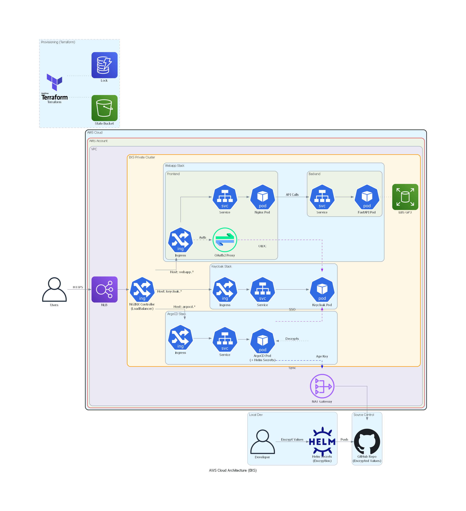
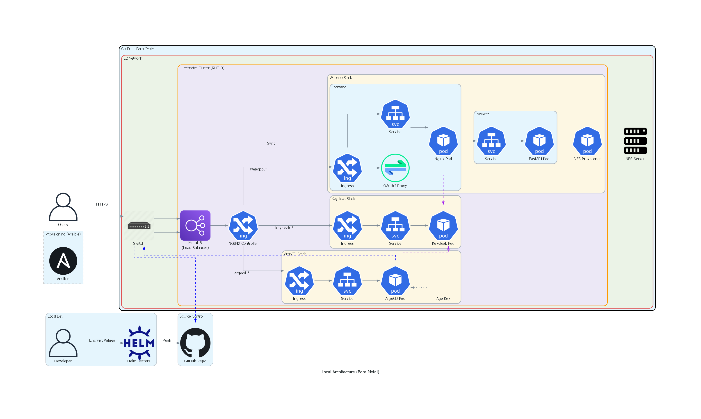
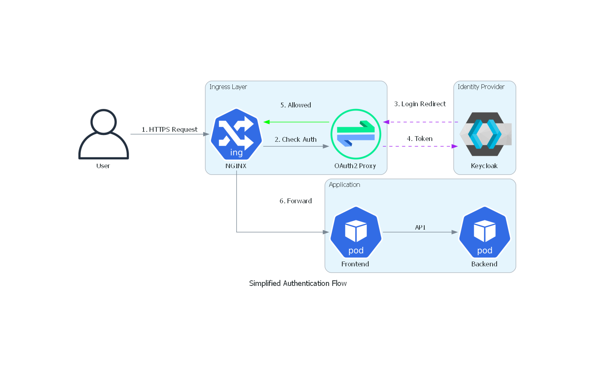
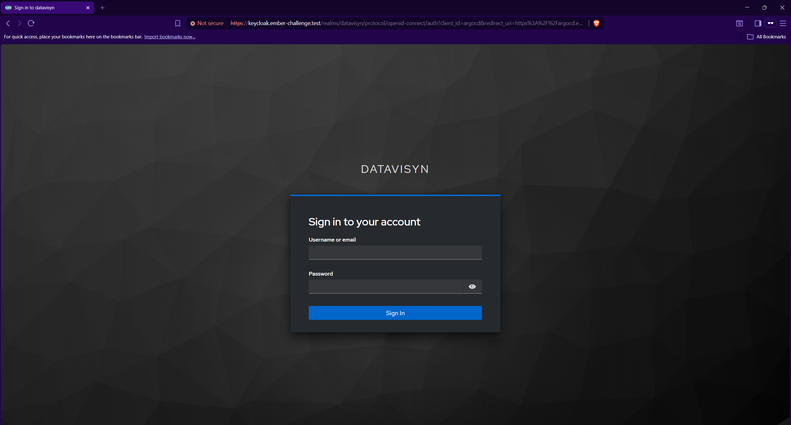
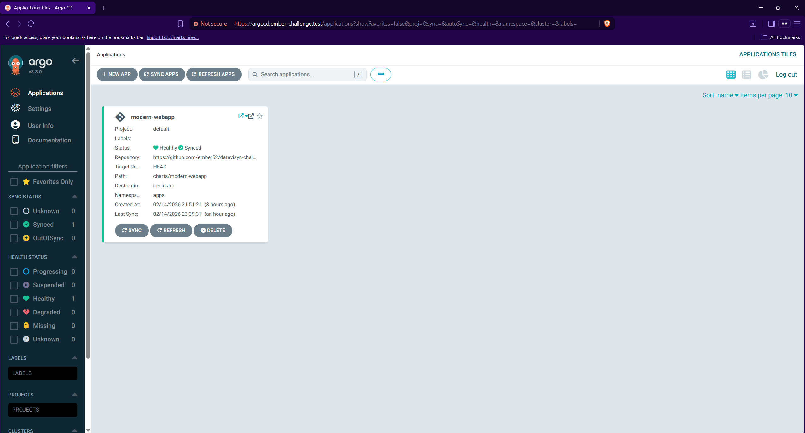
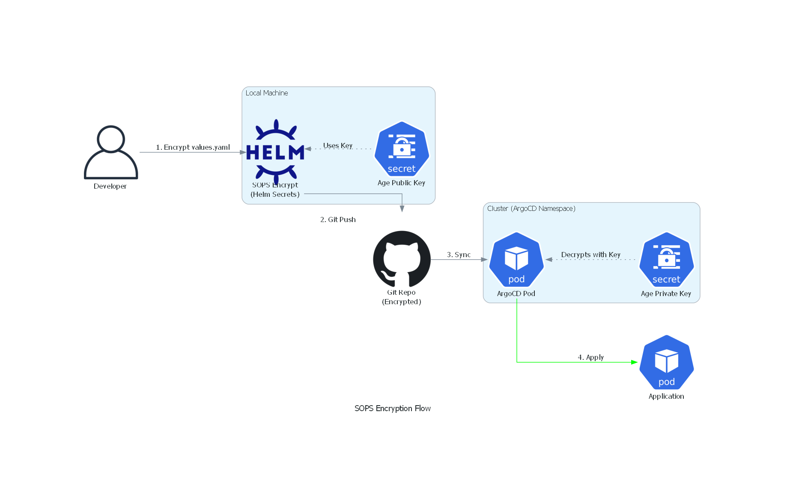
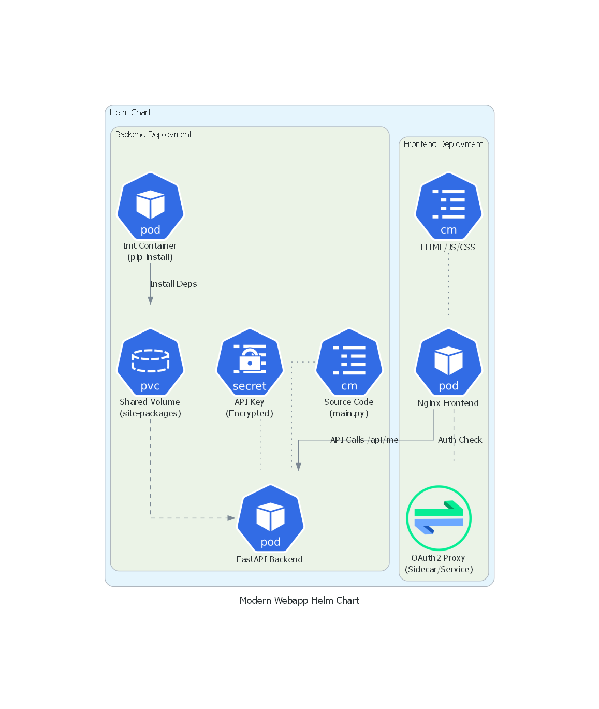
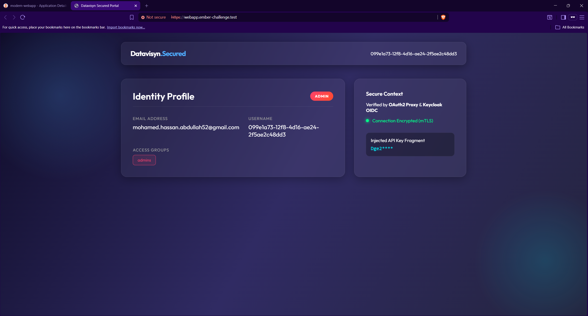
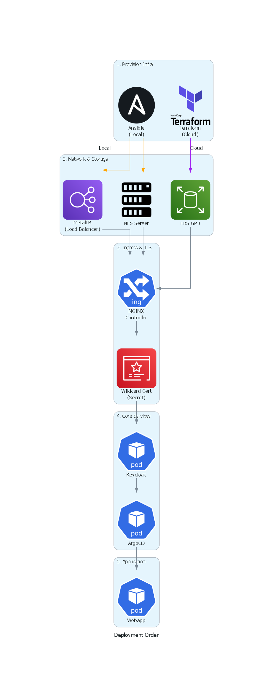

# Datavisyn DevOps Challenge

A production-grade Kubernetes platform featuring **dual infrastructure** (local bare-metal & AWS EKS), **GitOps** continuous delivery, **SSO authentication** via Keycloak, and **encrypted secrets** management with SOPS + Age.

---

## Table of Contents

- [Architecture Overview](#architecture-overview)
- [Tech Stack](#tech-stack)
- [Repository Structure](#repository-structure)
- [Part 1 — Infrastructure](#part-1--infrastructure)
  - [Option A: Local Cluster (RHEL9 + kubeadm)](#option-a-local-cluster-rhel9--kubeadm)
  - [Option B: Cloud Cluster (AWS EKS)](#option-b-cloud-cluster-aws-eks)
  - [Shared: NGINX Ingress Controller](#shared-nginx-ingress-controller)
  - [TLS Certificates (Self-Signed Wildcard)](#tls-certificates-self-signed-wildcard)
- [Part 2 — Keycloak & ArgoCD](#part-2--keycloak--argocd)
  - [Keycloak (Identity Provider)](#keycloak-identity-provider)
  - [ArgoCD (GitOps Engine)](#argocd-gitops-engine)
  - [SOPS + Age (Secrets Encryption)](#sops--age-secrets-encryption)
- [Part 3 — Webapp & OAuth2](#part-3--webapp--oauth2)
  - [Modern Webapp Helm Chart](#modern-webapp-helm-chart)
  - [OAuth2 Proxy (Authentication Gate)](#oauth2-proxy-authentication-gate)
  - [GitOps Deployment via ArgoCD](#gitops-deployment-via-argocd)
- [Key Domains](#key-domains)
- [References](#references)

---

## Architecture Overview

### Cloud Architecture (AWS EKS)



### Local Architecture (Bare-Metal)



### Authentication Flow



---

## Tech Stack

| Layer               | Component                  | Purpose                                        |
|---------------------|----------------------------|-------------------------------------------------|
| **Infrastructure**  | Terraform                  | Provision AWS EKS cluster (VPC, IAM, EKS)       |
|                     | Ansible                    | Provision local RHEL9 cluster (kubeadm + CRI-O) |
| **Networking**      | NGINX Ingress Controller   | TLS termination, routing, auth subrequests       |
|                     | MetalLB                    | LoadBalancer for bare-metal (no cloud LB)        |
| **Identity**        | Keycloak (Bitnami)         | OIDC Identity Provider, realm & client config    |
|                     | OAuth2 Proxy               | Authentication gate in front of the webapp       |
| **GitOps**          | ArgoCD                     | Continuous delivery from Git to cluster          |
| **Secrets**         | SOPS + Age                 | Encrypt secrets in Git, decrypt at deploy time   |
|                     | helm-secrets plugin        | Integrates SOPS decryption into ArgoCD           |
| **Application**     | FastAPI (Python 3.11)      | Backend API (`/api/me` identity endpoint)        |
|                     | NGINX + Vanilla JS         | Frontend with glassmorphism design               |
| **Storage**         | NFS Provisioner            | Dynamic PVs for local cluster                    |
|                     | EBS CSI Driver (GP3)       | Dynamic PVs for EKS cluster                      |
| **TLS**             | Self-Signed Wildcard Cert  | HTTPS for all services (default SSL certificate) |

### Tools Comparison with Alternative Approaches

| Concern               | This Project                         | Alternative Approach (e.g. colleague) |
|------------------------|--------------------------------------|---------------------------------------|
| **Identity Provider**  | Keycloak (self-hosted OIDC)          | GitHub OAuth (external)               |
| **Secrets Management** | SOPS + Age (file-level encryption)   | Sealed Secrets (cluster-side)         |
| **TLS Certificates**   | Self-signed wildcard (manual)        | Cert Manager + Let's Encrypt          |
| **DNS**                | Local `/etc/hosts` + `.test` domain  | GoDaddy (public domain)              |
| **Infrastructure**     | Terraform + Ansible (dual setup)     | Terraform only (cloud only)           |
| **Container Runtime**  | CRI-O                                | containerd                            |

---

## Repository Structure

```
datavisyn-challenge/
│
├── infrastructure/
│   ├── local/                    # On-premises bare-metal setup
│   │   ├── ansible/              # Ansible playbooks & roles
│   │   │   ├── inventory.ini     # Host inventory (master, workers, nfs)
│   │   │   ├── site.yml          # Main playbook
│   │   │   ├── group_vars/       # Shared variables (k8s version, CIDRs)
│   │   │   └── roles/
│   │   │       ├── common/       # Swap, SELinux, kernel modules, repos, k8s + CRI-O
│   │   │       ├── master/       # kubeadm init, Helm install, join token
│   │   │       ├── worker/       # kubeadm join
│   │   │       └── nfs/          # NFS server setup for persistent storage
│   │   └── scripts/
│   │       ├── metallb.yaml      # MetalLB IP pool + L2 advertisement
│   │       └── storageClass-setup.sh  # NFS StorageClass provisioner
│   │
│   ├── cloud/                    # AWS EKS setup
│   │   ├── terraform/            # Terraform IaC
│   │   │   ├── backend.tf        # S3 remote state + DynamoDB locking
│   │   │   ├── vpc.tf            # VPC, subnets (3 AZs), NAT gateways
│   │   │   ├── eks.tf            # EKS cluster, node groups, addons
│   │   │   ├── variables.tf      # Configurable parameters
│   │   │   ├── versions.tf       # Provider versions + auth config
│   │   │   └── outputs.tf        # Cluster endpoint, OIDC ARN
│   │   └── kubernetes/
│   │       └── gp3-storage-class.yaml  # GP3 EBS default StorageClass
│   │
│   └── shared/
│       └── ingress-controller.sh # NGINX Ingress Controller (both setups)
│
├── charts/
│   └── modern-webapp/            # Helm chart for the application
│       ├── Chart.yaml            # Chart metadata + oauth2-proxy dependency
│       ├── values.yaml           # Configuration (SOPS-encrypted secrets)
│       └── templates/
│           ├── backend-deployment.yaml   # FastAPI with init container
│           ├── frontend-deployment.yaml  # NGINX serving static files
│           ├── configmap-backend.yaml    # Python source code (main.py)
│           ├── configmap-frontend.yaml   # HTML, CSS, JS source code
│           ├── ingress.yaml              # Routing rules + OAuth2 annotations
│           ├── services.yaml             # ClusterIP services (frontend + backend)
│           ├── secret.yaml               # API key secret from values
│           └── _helpers.tpl              # Naming conventions
│
├── argocd/
│   └── modern-webapp-application.yaml  # ArgoCD Application manifest
│
├── helm-values/
│   ├── argocd/
│   │   └── argocd-values.yaml    # ArgoCD Helm values (Dex OIDC, helm-secrets)
│   └── keycloak/
│       └── keycloak-values.yaml  # Keycloak Helm values (Bitnami)
│
├── docs/
│   └── diagrams/                 # Architecture diagrams (source + rendered PNG)
│
├── README.md
└── .gitignore
```

---

## Part 1 — Infrastructure

> **Goal:** Provision a Kubernetes cluster with networking, storage, and TLS — on either bare-metal or AWS.

### Prerequisites

| Tool        | Version  | Purpose                          |
|-------------|----------|----------------------------------|
| `kubectl`   | ≥ 1.28   | Kubernetes CLI                   |
| `helm`      | ≥ 3.14   | Package manager for Kubernetes   |
| `sops`      | ≥ 3.8    | Secrets encryption               |
| `age`       | ≥ 1.1    | Encryption key tool (for SOPS)   |
| `terraform` | ≥ 1.0    | Infrastructure as Code (EKS)     |
| `aws` CLI   | ≥ 2.0    | AWS authentication (EKS only)    |
| `ansible`   | ≥ 2.15   | Configuration management (local) |

---

### Option A: Local Cluster (RHEL9 + kubeadm)

This setup provisions a multi-node Kubernetes cluster on **RHEL9 bare-metal** servers using **Ansible** and **kubeadm** with **CRI-O** as the container runtime.

#### Why MetalLB?

On bare-metal, there is no cloud provider to provision a `LoadBalancer` Service. Without MetalLB, the NGINX Ingress Controller Service would remain stuck in `<pending>` state indefinitely. **MetalLB** solves this by:

1. **Allocating IPs** from a configured address pool
2. **Advertising them** via Layer 2 (ARP) to the local network
3. Making `LoadBalancer` Services work identically to cloud environments

This is essential because the Ingress Controller needs an external IP to receive traffic from users' browsers.

#### Deployment Steps

**1. Configure Inventory**

Edit `infrastructure/local/ansible/inventory.ini` with your server IPs:

```ini
[master]
192.168.1.100

[workers]
192.168.1.101
192.168.1.102

[nfs]
192.168.1.100

[all:vars]
ansible_user=root
```

**2. Run the Ansible Playbook**

```bash
ansible-playbook -i infrastructure/local/ansible/inventory.ini \
  infrastructure/local/ansible/site.yml
```

This playbook applies the following roles in order:

| Role       | What it does                                                          |
|------------|-----------------------------------------------------------------------|
| `nfs`      | Installs NFS server, creates export directory, starts NFS service     |
| `common`   | Disables swap, SELinux → permissive, kernel modules, repos, installs kubeadm + CRI-O |
| `master`   | `kubeadm init`, installs Helm, generates join token                   |
| `worker`   | Joins worker nodes to the cluster via `kubeadm join`                  |

**3. Install MetalLB**

```bash
# Install MetalLB
kubectl apply -f https://raw.githubusercontent.com/metallb/metallb/v0.15.2/config/manifests/metallb-native.yaml

# Wait for pods to be ready
kubectl wait --namespace metallb-system --for=condition=ready pod --all --timeout=120s

# Apply IP pool configuration
kubectl apply -f infrastructure/local/scripts/metallb.yaml
```

**4. Set Up NFS StorageClass**

```bash
bash infrastructure/local/scripts/storageClass-setup.sh
```


---

### Option B: Cloud Cluster (AWS EKS)

This setup provisions a managed Kubernetes cluster on **AWS EKS** using **Terraform**.

#### AWS Account Requirements

| Requirement                   | Details                                              |
|-------------------------------|------------------------------------------------------|
| **IAM Permissions**           | EKS, EC2, VPC, IAM, S3, DynamoDB (for state)        |
| **S3 Bucket**                 | For Terraform remote state storage                   |
| **DynamoDB Table**            | For Terraform state locking (partition key: `LockID`) |
| **Region**                    | Configurable (default: `eu-west-2`)                  |
| **Service Quotas**            | At least 2× `t3.medium` instances in target region   |

> **Note:** Before running Terraform, you need:
> 1. An S3 bucket created manually for storing `.tfstate` files
> 2. A DynamoDB table with `LockID` as the partition key to prevent concurrent state modifications
> 3. AWS CLI configured with `aws configure` or environment variables (`AWS_ACCESS_KEY_ID`, `AWS_SECRET_ACCESS_KEY`)

#### What Terraform Creates

| Resource                     | Purpose                                    |
|------------------------------|--------------------------------------------|
| **VPC** (3 AZs)              | Networking with public + private subnets   |
| **NAT Gateways** (1 per AZ)  | Internet access for private subnets        |
| **EKS Cluster** (v1.31)      | Managed Kubernetes control plane           |
| **Managed Node Group**        | 2× `t3.medium` ON_DEMAND instances        |
| **EBS CSI Driver Addon**      | Persistent volume support (GP3)            |
| **OIDC Provider (IRSA)**      | IAM Roles for Service Accounts             |

#### Deployment Steps

**1. Configure Backend**

Edit `infrastructure/cloud/terraform/backend.tf` — replace `<YOUR_S3_BUCKET_NAME>` and `<YOUR_DYNAMODB_TABLE>` with your actual resource names.

**2. Initialize and Apply**

```bash
cd infrastructure/cloud/terraform

# Initialize providers and modules
terraform init

# Review the plan
terraform plan

# Apply infrastructure (takes ~15 minutes)
terraform apply
```

**3. Configure kubectl**

```bash
aws eks update-kubeconfig --region eu-west-2 --name datavisyn-challenge-cluster
```

**4. Apply GP3 StorageClass**

```bash
kubectl apply -f infrastructure/cloud/kubernetes/gp3-storage-class.yaml
```


---

### Shared: NGINX Ingress Controller

Both setups require the NGINX Ingress Controller for TLS termination and routing:

```bash
kubectl apply -f https://raw.githubusercontent.com/kubernetes/ingress-nginx/controller-v1.14.0/deploy/static/provider/cloud/deploy.yaml

# Wait for it to be ready
kubectl wait --namespace ingress-nginx --for=condition=ready pod \
  --selector=app.kubernetes.io/component=controller --timeout=120s
```

- On **local**, MetalLB assigns the controller a real IP from its address pool.
- On **EKS**, AWS automatically provisions an NLB (Network Load Balancer) with a public endpoint.

---

### TLS Certificates (Self-Signed Wildcard)

Since this is a challenge environment using a `.test` domain (not publicly routable), we use a **self-signed wildcard certificate** instead of Let's Encrypt / Cert Manager.

The key insight is that we create **one wildcard certificate** (`*.ember-challenge.test`) and set it as the **default SSL certificate** on the NGINX Ingress Controller. This means every Ingress resource automatically gets HTTPS without needing to specify `tls.secretName` individually.

**1. Generate the wildcard certificate:**

```bash
# Generate CA key and certificate
openssl req -x509 -nodes -newkey rsa:4096 \
  -keyout ca.key -out ca.crt -days 365 \
  -subj "/CN=Ember Challenge CA"

# Generate server key and CSR with wildcard
openssl req -nodes -newkey rsa:4096 \
  -keyout tls.key -out tls.csr \
  -subj "/CN=*.ember-challenge.test"

# Sign the certificate with our CA (wildcard SAN)
openssl x509 -req -in tls.csr -CA ca.crt -CAkey ca.key \
  -CAcreateserial -out tls.crt -days 365 \
  -extfile <(printf "subjectAltName=DNS:*.ember-challenge.test")
```

**2. Create the TLS secret in the ingress-nginx namespace:**

```bash
kubectl create secret tls default-tls-secret \
  --cert=tls.crt --key=tls.key -n ingress-nginx
```

**3. Set it as the Ingress Controller's default certificate:**

```bash
# Patch the Ingress Controller deployment to use the wildcard cert as default
kubectl -n ingress-nginx patch deployment ingress-nginx-controller \
  --type=json \
  -p='[{"op":"add","path":"/spec/template/spec/containers/0/args/-","value":"--default-ssl-certificate=ingress-nginx/default-tls-secret"}]'
```

Now **all Ingress resources** across every namespace (webapp, keycloak, argocd) automatically receive this wildcard TLS certificate. No per-service TLS secrets or `tls` blocks are needed in individual Ingress manifests.

**4. DNS Resolution (local development):**

Add these entries to your machine's hosts file (`/etc/hosts` or `C:\Windows\System32\drivers\etc\hosts`):

```
<INGRESS_EXTERNAL_IP>  webapp.ember-challenge.test
<INGRESS_EXTERNAL_IP>  keycloak.ember-challenge.test
<INGRESS_EXTERNAL_IP>  argocd.ember-challenge.test
```

> **Tip:** Get the external IP with: `kubectl get svc -n ingress-nginx`

---

## Part 2 — Keycloak & ArgoCD

> **Goal:** Deploy the identity provider and the GitOps engine — the two foundational platform services that everything else depends on.

### Keycloak (Identity Provider)

[Keycloak](https://www.keycloak.org/) is a self-hosted OpenID Connect (OIDC) identity provider. It manages users, realms, and client applications. Both ArgoCD and the webapp authenticate through Keycloak.

**Install Keycloak via Helm (Bitnami):**

```bash
# Create namespace
kubectl create namespace keycloak

# Install
helm install keycloak oci://registry-1.docker.io/bitnamicharts/keycloak \
  -n keycloak \
  -f helm-values/keycloak/keycloak-values.yaml
```

**Post-Install Configuration (Keycloak Admin Console):**

1. Login at `https://keycloak.ember-challenge.test` with admin credentials
2. Create a realm: `datavisyn`
3. Create a client for **ArgoCD**: `argocd` (confidential, redirect URI: `https://argocd.ember-challenge.test/auth/callback`)
4. Create a client for **Webapp**: `webapp-client` (confidential, redirect URI: `https://webapp.ember-challenge.test/oauth2/callback`)
5. Create a user group: `admins`
6. Create a test user and assign them to the `admins` group



---

### ArgoCD (GitOps Engine)

[ArgoCD](https://argo-cd.readthedocs.io/) watches the GitHub repository for changes and automatically syncs Helm charts and Kubernetes manifests to the cluster. It uses **Dex** as an OIDC broker to authenticate administrators via Keycloak.

**Install ArgoCD via Helm:**

```bash
# Create namespace
kubectl create namespace argocd

# Install with custom values (includes Dex OIDC + helm-secrets config)
helm install argocd oci://ghcr.io/argoproj/argo-helm/argo-cd \
  -n argocd \
  -f helm-values/argocd/argocd-values.yaml
```

**What the ArgoCD values configure:**

| Feature                   | How                                                   |
|---------------------------|-------------------------------------------------------|
| **SSO via Keycloak**      | Dex OIDC connector pointing to Keycloak's realm       |
| **helm-secrets plugin**   | Init container downloads SOPS, Age, vals, kubectl      |
| **SOPS decryption**       | Age private key mounted from `helm-secrets-private-keys` secret |
| **RBAC**                  | `admins` group → `role:admin`                          |
| **DNS resolution**        | `hostAliases` for Keycloak (when not in public DNS)    |





---

### SOPS + Age (Secrets Encryption)

Sensitive values in `charts/modern-webapp/values.yaml` are encrypted using **SOPS** with **Age** encryption. This allows secrets to live safely in Git while being decryptable only by holders of the private key.

**Encrypted fields:** `apiKey`, `clientSecret`, `cookieSecret`



**How it works:**

1. Developer encrypts `values.yaml` using `sops --encrypt` with the Age public key
2. Encrypted file is committed and pushed to GitHub
3. ArgoCD syncs the chart and uses the `helm-secrets` plugin to decrypt at deploy time
4. The Age private key is stored as a Kubernetes Secret (`helm-secrets-private-keys`) in the `argocd` namespace

**Create the Age decryption key secret in the cluster:**

```bash
kubectl create secret generic helm-secrets-private-keys \
  --from-file=key.txt=<PATH_TO_AGE_KEY> -n argocd
```

**Encrypt/decrypt locally:**

```bash
# Encrypt before committing
export SOPS_AGE_KEY_FILE=key.txt
sops --encrypt --in-place charts/modern-webapp/values.yaml

# Decrypt for editing
sops --decrypt --in-place charts/modern-webapp/values.yaml
```

---

## Part 3 — Webapp & OAuth2

> **Goal:** Deploy the modern web application with OAuth2 authentication, managed entirely through GitOps.

### Modern Webapp Helm Chart

The application consists of two services deployed as a single Helm chart:

| Component   | Image            | Role                                              |
|-------------|------------------|----------------------------------------------------|
| **Backend** | `python:3.11-slim` | FastAPI app serving `/api/me` (identity endpoint)  |
| **Frontend**| `nginx:alpine`    | Static files (HTML/CSS/JS) with glassmorphism UI   |



The **init container** installs Python dependencies (`fastapi`, `uvicorn`) into a shared `emptyDir` volume, which the backend container then references via `PYTHONPATH`. The source code for both backend and frontend is stored in **ConfigMaps**, making the entire application deployable without building custom Docker images.

---

### OAuth2 Proxy (Authentication Gate)

[OAuth2 Proxy](https://oauth2-proxy.github.io/oauth2-proxy/) sits in front of the webapp and ensures every request is authenticated. It is deployed as a **subchart** dependency within the modern-webapp Helm chart.

**How the Ingress integrates with OAuth2 Proxy:**

The NGINX Ingress Controller uses `auth-url` and `auth-signin` annotations to perform an authentication subrequest to OAuth2 Proxy on every incoming request:

```yaml
# From ingress.yaml
annotations:
  nginx.ingress.kubernetes.io/auth-url: "http://modern-webapp-oauth2-proxy.apps.svc.cluster.local/oauth2/auth"
  nginx.ingress.kubernetes.io/auth-signin: "https://webapp.ember-challenge.test/oauth2/start?rd=$escaped_request_uri"
  nginx.ingress.kubernetes.io/auth-response-headers: "X-Auth-Request-Email,X-Auth-Request-User,X-Auth-Request-Groups"
```

When OAuth2 Proxy returns `200 OK`, the user's identity headers (`X-Auth-Request-User`, `X-Auth-Request-Email`, `X-Auth-Request-Groups`) are forwarded to the backend, where FastAPI reads them to build the identity response.



---

### GitOps Deployment via ArgoCD

The webapp is deployed through ArgoCD, not manually. The ArgoCD Application manifest points to this repository:

```yaml
# argocd/modern-webapp-application.yaml
spec:
  source:
    repoURL: https://github.com/ember52/datavisyn-challenge.git
    targetRevision: HEAD
    path: charts/modern-webapp
    helm:
      valueFiles:
        - secrets://values.yaml   # ← helm-secrets decrypts SOPS-encrypted values
  destination:
    server: https://kubernetes.default.svc
    namespace: apps
  syncPolicy:
    automated:
      prune: true      # Remove resources no longer in Git
      selfHeal: true   # Revert manual changes
```

**Deploy the application:**

```bash
kubectl apply -f argocd/modern-webapp-application.yaml
```

ArgoCD will:
1. Clone this repository
2. Decrypt `values.yaml` using the SOPS Age key
3. Run `helm template` with the decrypted values
4. Apply the resulting manifests to the `apps` namespace
5. Continuously watch for changes and auto-sync

---

## Deployment Order (Summary)



| Step | Action | Command |
|------|--------|---------|
| 1 | Provision cluster | `ansible-playbook ...` or `terraform apply` |
| 2 | Install MetalLB (local only) | `kubectl apply -f metallb-native.yaml` |
| 3 | Apply StorageClass | `storageClass-setup.sh` or `kubectl apply -f gp3-storage-class.yaml` |
| 4 | Install Ingress Controller | `kubectl apply -f ingress-nginx/deploy.yaml` |
| 5 | Create wildcard TLS cert | `openssl ...` + `kubectl create secret tls ...` + patch controller |
| 6 | Deploy Keycloak | `helm install keycloak ...` |
| 7 | Configure Keycloak | Manual: realm, clients, users |
| 8 | Deploy ArgoCD + SOPS key | `helm install argocd ...` + `kubectl create secret ...` |
| 9 | Apply ArgoCD Application | `kubectl apply -f argocd/modern-webapp-application.yaml` |
| 10 | ArgoCD auto-deploys webapp | Automatic (GitOps) |

---

## Key Domains

| Service    | URL                                    | Namespace  |
|------------|----------------------------------------|------------|
| Webapp     | `https://webapp.ember-challenge.test`  | `apps`     |
| Keycloak   | `https://keycloak.ember-challenge.test`| `keycloak` |
| ArgoCD     | `https://argocd.ember-challenge.test`  | `argocd`   |

---

## References

### Documentation & Official Resources
- [AWS EKS Documentation](https://docs.aws.amazon.com/eks/)
- [NGINX Ingress Controller](https://kubernetes.github.io/ingress-nginx/)
- [OAuth2 Proxy](https://oauth2-proxy.github.io/oauth2-proxy/)
- [FastAPI](https://fastapi.tiangolo.com/)
- [ArgoCD](https://argo-cd.readthedocs.io/)
- [Keycloak](https://www.keycloak.org/documentation)
- [SOPS](https://github.com/getsops/sops)
- [Age Encryption](https://github.com/FiloSottile/age)
- [MetalLB](https://metallb.universe.tf/)

### Terraform Modules
- [terraform-aws-modules/vpc/aws](https://github.com/terraform-aws-modules/terraform-aws-vpc)
- [terraform-aws-modules/eks/aws](https://github.com/terraform-aws-modules/terraform-aws-eks)

### Helm Charts
- [argo-cd](https://artifacthub.io/packages/helm/argo/argo-cd)
- [keycloak (Bitnami)](https://artifacthub.io/packages/helm/bitnami/keycloak)
- [oauth2-proxy](https://artifacthub.io/packages/helm/oauth2-proxy/oauth2-proxy)
- [ingress-nginx](https://artifacthub.io/packages/helm/ingress-nginx/ingress-nginx)

---

## Author

**Mohamed Hassan Abdullah**
